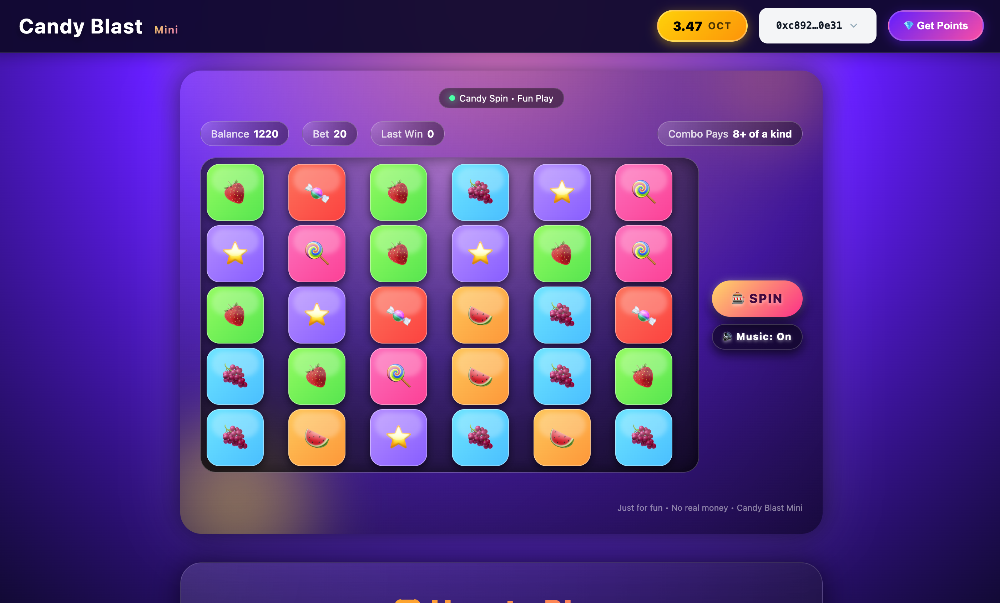
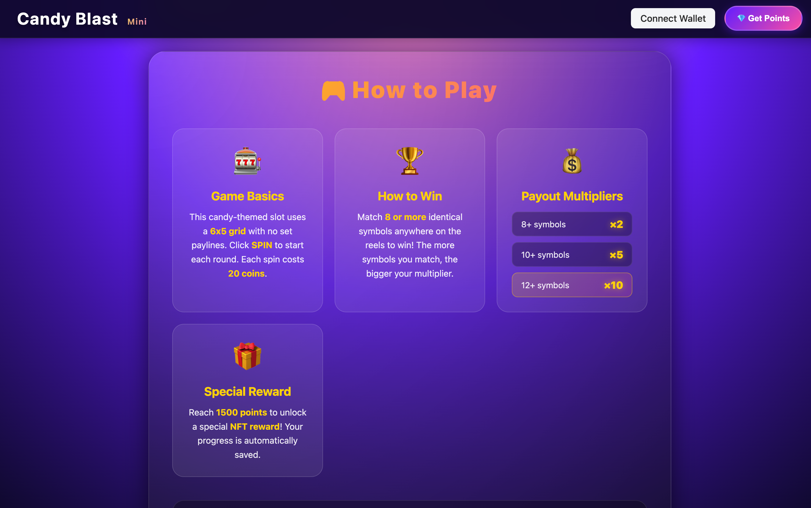
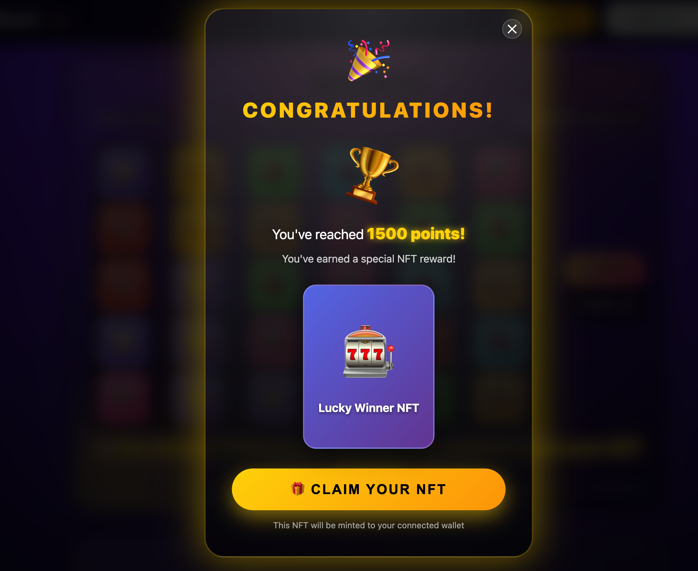

# 🍬 Candy Blast Mini

A blockchain-powered candy-themed slot game built on the **One Chain** network. Players can spin colorful candy reels, earn points, and unlock exclusive NFT rewards!

## 🎮 Game Overview

**Candy Blast Mini** is an exciting 6x5 grid slot game where players match vibrant candy symbols to win points. The game integrates blockchain technology to provide a transparent, decentralized gaming experience with real NFT rewards.

### Key Features

-  **6x5 Grid Slot Mechanics** - No fixed paylines, match symbols anywhere on the reels
-  **Blockchain Integration** - Built on One Chain for transparency and security
-  **NFT Rewards** - Earn special NFTs by reaching milestone points
-  **Token Economy** - Purchase game points using OCT tokens
-  **Vibrant Graphics** - Beautiful candy-themed UI with smooth animations

## How to Play

### Game Basics
- The game uses a **6x5 grid** with no set paylines
- Click **SPIN** to start each round
- Each spin costs **20 coins** from your balance
- Match **8 or more** identical symbols anywhere on the reels to win
- The more symbols you match, the bigger your multiplier!

### Winning Combinations

| Symbols Matched | Payout Multiplier |
|----------------|-------------------|
| 8+ symbols     | ×2               |
| 10+ symbols    | ×5               |
| 12+ symbols    | ×10              |

### Special Reward System
 **Reach 1500 points** to unlock a special **NFT reward**! Your progress is automatically saved on the blockchain.

##  NFT Rewards

When you reach **1500 points**, you'll receive a congratulations message and can claim your exclusive **Lucky Winner NFT**. This NFT will be minted directly to your connected wallet as proof of your achievement!

##  Token Economy

### Get Points
- Purchase **1000 game points** for **0.1 OCT tokens**
- Click the **"Get Points"** button in the top right corner
- Points are instantly credited to your account
- Transaction is recorded on the blockchain for transparency

### Game Balance
- Starting balance: varies based on points purchased
- Each spin costs: **20 coins**
- Winnings are added to your balance based on multipliers

## 🔧 Smart Contract Features

The Sweet Bonanza smart contract provides the following functionality:

### Core Functions

1. **`mint_nft(url, points, ctx)`**
   - Mints a PlayerNFT to the caller's wallet
   - NFT contains metadata including URL, owner address, and points earned

2. **`get_points(coin, balance, ctx)`**
   - Exchanges OCT tokens for game points
   - Cost: 0.1 OCT (100,000,000 MIST) = 1000 points
   - Updates user's point balance in the shared UserPoints table

### Current Features
-  Candy-themed 6x5 slot game
-  Point purchase system with OCT tokens
-  NFT reward system at milestone points
-  Persistent user balances stored on-chain
-  Transparent, blockchain-verified gameplay

### Future Enhancements
-  Additional candy symbols and special power-ups
-  Leaderboard system
-  Multiple NFT tiers for different achievements
-  Tournament modes
-  Social features and multiplayer
